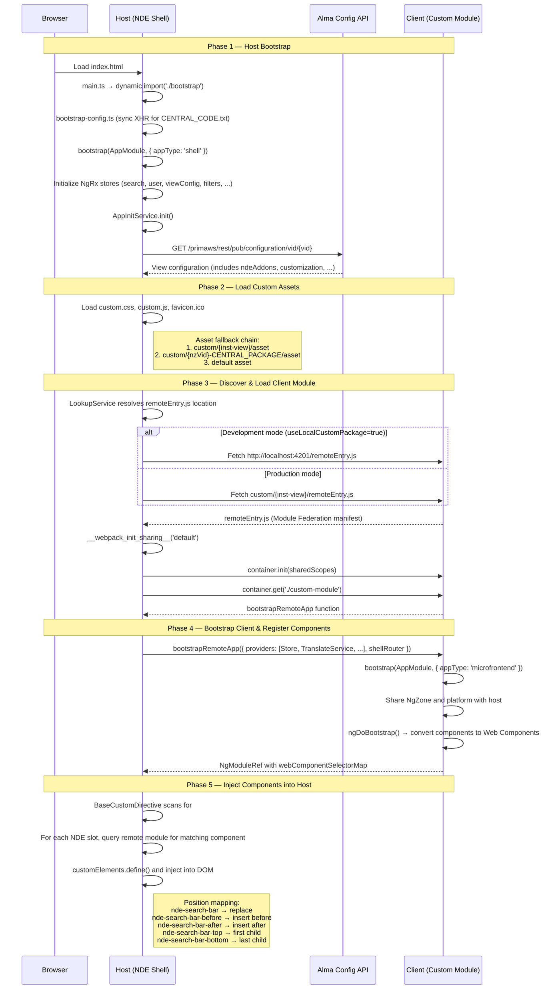

# NDE Custom Module

A development toolkit for building custom UI components for Ex Libris Primo's **New Discovery Experience (NDE)**. This project lets you create, preview, and deploy your own components that integrate directly into the NDE interface.

---

## Table of Contents

- [How It Works — The Big Picture](#how-it-works--the-big-picture)
- [Key Technologies](#key-technologies)
- [Boot Process](#boot-process)
- [How Host and Client Share Data](#how-host-and-client-share-data)
- [Prerequisites](#prerequisites)
- [Getting Started](#getting-started)
- [Configuration (package.json)](#configuration-packagejson)
- [Creating Components with @NDEComponent](#creating-components-with-ndecomponent)
- [Intercepting HTTP Traffic](#intercepting-http-traffic)
- [Reacting to HTTP Traffic with @NDEEvent](#reacting-to-http-traffic-with-ndeevent)
- [Accessing Host Data](#accessing-host-data)
- [Working with Assets](#working-with-assets)
- [Creating a Custom Color Theme](#creating-a-custom-color-theme)
- [Understanding the Proxy Logs](#understanding-the-proxy-logs)
- [Building and Deploying](#building-and-deploying)
- [Developing an Add-On](#developing-an-add-on)
- [Recommended Development Environment](#recommended-development-environment)
- [Additional Resources](#additional-resources)

---

## How It Works — The Big Picture

The NDE interface is a large web application (the **host**) that runs in the browser. Your custom module is a separate, smaller application (the **client**) that the host loads at runtime. They share the same page, the same Angular framework, and the same application state.

This is made possible by two technologies:

- **Angular** — A framework for building web applications using components (reusable UI building blocks). You write components in TypeScript/HTML/CSS and Angular turns them into interactive UI. If you are new to Angular, the [official tutorial](https://angular.dev/tutorials/learn-angular) is a good starting point.

- **Module Federation** (via Webpack) — A mechanism that lets separately-built applications share code at runtime. The host application loads your custom module's `remoteEntry.js` file, which tells it what components you provide. They share common libraries (Angular, RxJS, NgRx) so there is no duplication. For more background, see the [Webpack Module Federation docs](https://webpack.js.org/concepts/module-federation/) and the [@angular-architects/module-federation plugin](https://www.npmjs.com/package/@angular-architects/module-federation).

In practice, you write Angular components, decorate them with `@NDEComponent`, and the build system handles the rest — packaging them as a federated module that the NDE host can discover and render.

---

## Key Technologies

| Technology | Version | Purpose |
|---|---|---|
| [Angular](https://angular.dev/) | 18.2 | Component framework |
| [TypeScript](https://www.typescriptlang.org/) | 5.5 | Typed JavaScript |
| [Webpack](https://webpack.js.org/) | 5.88 | Build tool and module bundler |
| [@angular-architects/module-federation](https://www.npmjs.com/package/@angular-architects/module-federation) | 18.0 | Module Federation plugin for Angular |
| [NgRx Store](https://ngrx.io/guide/store) | 18.1 | Centralized state management |
| [RxJS](https://rxjs.dev/) | 7.8 | Reactive programming (Observables) |
| [Angular Material](https://material.angular.io/) | 18.2 | Material Design UI components |
| [@ngx-translate/core](https://github.com/ngx-translate/core) | 15.0 | Internationalization |
| [@libis/primo-shared-state](https://github.com/libis/primo-shared-state) | 1.0.0 | Shared state services between host and client |

---

## Boot Process

The following diagram shows how the NDE host application discovers and loads your custom module at runtime.



---

## How Host and Client Share Data

The host and client share a single **NgRx Store** instance. NgRx is a state management library — think of it as a centralized database for the application's runtime data (the current user, search results, applied filters, etc.).

Because Module Federation marks `@ngrx/store` as a **singleton**, both the host and your custom module operate on the exact same store instance. The host populates the store, and your components can read from it.

### @libis/primo-shared-state

The [`@libis/primo-shared-state`](https://github.com/libis/primo-shared-state) library provides type-safe services that wrap the NgRx store. Instead of writing raw selectors, you inject a service and call its methods.

Three services are available: **SearchStateService**, **UserStateService**, and **FilterStateService**. Each service offers two access patterns:

- **Reactive (Observable)** — method names end with `$`. Your component updates automatically whenever the underlying data changes. Best for templates using the `| async` pipe or for components that need to react in real time.
- **Snapshot (Promise)** — one-time reads of the current value. Useful in lifecycle hooks, click handlers, or anywhere you just need the value right now.

> **Tip:** If you are new to Observables, see the [RxJS guide](https://rxjs.dev/guide/overview). For NgRx, see the [NgRx Store documentation](https://ngrx.io/guide/store).

### A Note on Angular Signals vs Observables

Angular 18 ships with **Signals** as a stable reactive primitive. Signals are well suited for synchronous, fine-grained state (local component state, computed values, NgRx store reads via `store.selectSignal()`), and they can simplify templates by removing the need for the `| async` pipe.

However, **Signals are a complement to Observables, not a replacement.** Observables remain the right tool for inherently asynchronous or event-driven work:

| Use Signals for | Keep Observables for |
|---|---|
| Local component state (`signal()`, `computed()`) | HTTP calls (`HttpClient`) |
| NgRx store reads (`store.selectSignal()`) | HTTP interceptors (`HttpInterceptor`) |
| Derived/computed values | Router events (`router.events`) |
| Simple template bindings (no `\| async` needed) | Complex async composition (`switchMap`, `debounceTime`, `combineLatest`, ...) |

The Angular team has explicitly stated that RxJS is not being deprecated. A wholesale migration to Signals would bring no practical benefit and would lose the async composition capabilities that Observables provide.

**Current approach in this project:** The `@libis/primo-shared-state` services expose Observable-based selectors (methods ending with `$`) and Promise-based snapshots. Signal-based selectors may be added in a future version. In the meantime, you can use `store.selectSignal()` directly on the NgRx store for signal-based reads when that fits your component better (see [App State](#app-state-ngrx-store)).

---

### SearchStateService

Provides access to search results, search parameters, metadata, and loading status.

| Method | Returns | Description |
|---|---|---|
| `selectAllDocs$()` | `Observable<Doc[]>` | All search result documents |
| `selectDocById$(id)` | `Observable<Doc \| undefined>` | A specific document by its ID |
| `selectSearchParams$()` | `Observable<SearchParams \| null>` | Current search parameters (query, scope, sort, tab, ...) |
| `selectSearchMetaData$()` | `Observable<SearchMetaData \| null>` | Search metadata (facets, highlights, did-you-mean, ...) |
| `selectSearchStatus$()` | `Observable<LoadingStatus>` | Loading status: `'pending'` · `'loading'` · `'success'` · `'fail'` |
| `selectTotalResults$()` | `Observable<number>` | Total number of results |
| `selectPageSize$()` | `Observable<number \| null>` | Current page size |
| `selectIsLoading$()` | `Observable<boolean>` | `true` while a search is in progress |
| `getAllDocs()` | `Promise<Doc[]>` | Snapshot of all documents |
| `getDocById(id)` | `Promise<Doc \| undefined>` | Snapshot of a single document |
| `getSearchParams()` | `Promise<SearchParams \| null>` | Snapshot of current search parameters |

#### Example — Display search results with loading state

```typescript
import { Component, OnInit, OnDestroy } from '@angular/core';
import { CommonModule } from '@angular/common';
import { Subject, takeUntil } from 'rxjs';
import { NDEComponent, NDE_SLOTS, NDE_POSITION } from '../../decorators/nde-component.decorator';
import { SearchStateService, Doc, LoadingStatus } from '@libis/primo-shared-state';

@NDEComponent({ selector: NDE_SLOTS.SEARCH_RESULTS, position: NDE_POSITION.BEFORE })
@Component({
  selector: 'custom-result-banner',
  standalone: true,
  imports: [CommonModule],
  template: `
    <div *ngIf="status === 'loading'" class="loading">Searching...</div>
    <div *ngIf="status === 'success'" class="result-count">
      Found {{ totalResults }} results for "{{ query }}"
    </div>
  `
})
export class ResultBannerComponent implements OnInit, OnDestroy {
  status: LoadingStatus = 'pending';
  totalResults = 0;
  query = '';
  private destroy$ = new Subject<void>();

  constructor(private searchState: SearchStateService) {}

  ngOnInit() {
    this.searchState.selectSearchStatus$()
      .pipe(takeUntil(this.destroy$))
      .subscribe(status => this.status = status);

    this.searchState.selectTotalResults$()
      .pipe(takeUntil(this.destroy$))
      .subscribe(total => this.totalResults = total);

    this.searchState.selectSearchParams$()
      .pipe(takeUntil(this.destroy$))
      .subscribe(params => this.query = params?.q ?? '');
  }

  ngOnDestroy() {
    this.destroy$.next();
    this.destroy$.complete();
  }
}
```

#### Example — Get a single document by ID (snapshot)

```typescript
async showDocumentDetails(docId: string) {
  const doc = await this.searchState.getDocById(docId);
  if (doc) {
    console.log('Title:', doc.pnx?.display?.title);
    console.log('Context:', doc.context);       // 'L' (local), 'PC' (Primo Central), etc.
    console.log('Delivery:', doc.delivery);      // Physical/electronic delivery info
  }
}
```

#### Example — Access search metadata (facets, did-you-mean)

```typescript
this.searchState.selectSearchMetaData$()
  .pipe(takeUntil(this.destroy$))
  .subscribe(meta => {
    if (meta?.facets) {
      console.log('Available facets:', meta.facets);
    }
    if (meta?.did_u_mean) {
      console.log('Did you mean:', meta.did_u_mean);
    }
    if (meta?.highlights) {
      console.log('Highlighted terms:', meta.highlights);
    }
  });
```

#### Key data shapes

```typescript
// SearchParams — what the user searched for
interface SearchParams {
  q: string;               // Search query text
  scope: string;           // Search scope
  tab?: string;            // Active tab
  sort?: string;           // Sort field
  offset?: number;         // Pagination offset
  limit?: number;          // Page size
  qInclude?: string[];     // Include filters as query terms
  qExclude?: string[];     // Exclude filters as query terms
  multiFacets?: string[];  // Multi-facet selections
  lang?: string;           // Language code
  mode?: string;           // Search mode
  inst?: string;           // Institution
  // ... additional parameters
}

// Doc — a single search result
interface Doc {
  '@id': string;             // Document ID
  context: Context;          // 'L' | 'PC' | 'SP' | 'U' | 'NP'
  adaptor: Adaptor;          // Data source
  pnx: Pnx;                 // PNX record (display, search, delivery fields)
  delivery?: DocDelivery;    // Delivery/availability information
  enrichment?: Enrichment;   // Virtual browse enrichment
  expired?: boolean;         // Whether the document has expired
}

type LoadingStatus = 'pending' | 'loading' | 'success' | 'fail';
```

---

### UserStateService

Provides access to user authentication, JWT tokens, and user preferences.

| Method | Returns | Description |
|---|---|---|
| `selectUserState$()` | `Observable<UserState>` | The entire user state object |
| `selectJwt$()` | `Observable<string \| undefined>` | Raw JWT token string |
| `selectDecodedJwt$()` | `Observable<DecodedJwt \| undefined>` | Decoded JWT (user name, group, campus status, ...) |
| `selectIsLoggedIn$()` | `Observable<boolean>` | Whether the user is authenticated |
| `selectUserSettings$()` | `Observable<UserSettings \| undefined>` | User preferences (language, page size, email, ...) |
| `selectUserName$()` | `Observable<string \| undefined>` | User name (from decoded JWT) |
| `selectUserGroup$()` | `Observable<string>` | User group (defaults to `'GUEST'` when not logged in) |
| `getJwt()` | `Promise<string \| undefined>` | Snapshot of JWT token |
| `isLoggedIn()` | `Promise<boolean>` | Snapshot of login status |
| `getUserSettings()` | `Promise<UserSettings \| undefined>` | Snapshot of user settings |

#### Example — Show a personalized greeting

```typescript
import { Component } from '@angular/core';
import { CommonModule } from '@angular/common';
import { NDEComponent, NDE_SLOTS, NDE_POSITION } from '../../decorators/nde-component.decorator';
import { UserStateService } from '@libis/primo-shared-state';

@NDEComponent({ selector: NDE_SLOTS.HEADER, position: NDE_POSITION.BOTTOM })
@Component({
  selector: 'custom-user-greeting',
  standalone: true,
  imports: [CommonModule],
  template: `
    <div class="user-greeting" *ngIf="isLoggedIn$ | async">
      <span>Welcome, {{ userName$ | async }}!</span>
      <span class="badge">{{ userGroup$ | async }}</span>
    </div>
    <div class="guest-banner" *ngIf="(isLoggedIn$ | async) === false">
      <span>Sign in to access personalized features</span>
    </div>
  `
})
export class UserGreetingComponent {
  isLoggedIn$ = this.userState.selectIsLoggedIn$();
  userName$ = this.userState.selectUserName$();
  userGroup$ = this.userState.selectUserGroup$();

  constructor(private userState: UserStateService) {}
}
```

#### Example — Use JWT for API calls (snapshot)

```typescript
async callExternalApi() {
  const jwt = await this.userState.getJwt();
  if (!jwt) {
    console.warn('User is not logged in');
    return;
  }

  const response = await fetch('https://my-api.example.com/data', {
    headers: { 'Authorization': `Bearer ${jwt}` }
  });
  // ...
}
```

#### Example — Read decoded JWT details

```typescript
this.userState.selectDecodedJwt$()
  .pipe(takeUntil(this.destroy$))
  .subscribe(decoded => {
    if (decoded) {
      console.log('User:', decoded.userName);
      console.log('Display name:', decoded.displayName);
      console.log('Group:', decoded.userGroup);
      console.log('On campus:', decoded.onCampus);
      console.log('Auth profile:', decoded.authenticationProfile);
    }
  });
```

#### Example — Read user settings

```typescript
this.userState.selectUserSettings$()
  .pipe(takeUntil(this.destroy$))
  .subscribe(settings => {
    if (settings) {
      console.log('Preferred language:', settings.language);
      console.log('Results per page:', settings.resultsBulkSize);
      console.log('Email:', settings.email);
    }
  });
```

#### Key data shapes

```typescript
interface UserState {
  jwt: string | undefined;                   // Raw JWT token
  decodedJwt: DecodedJwt | undefined;       // Parsed JWT payload
  status: LoadingStatus;                     // Loading status
  isLoggedIn: boolean;                       // Authentication flag
  userSettings: UserSettings | undefined;    // User preferences
  userSettingsStatus: LoadingStatus;         // Settings loading status
  logoutReason: LogoutReason | undefined;    // 'user' | 'timeout'
}

interface DecodedJwt {
  userName: string;              // Login username
  displayName: string;           // Human-readable name
  userGroup: string;             // Group/role (e.g., 'STAFF', 'STUDENT')
  onCampus: boolean;             // Whether user is on campus network
  signedIn: boolean;             // Signed-in flag
  authenticationProfile: string; // Authentication profile used
  user: string;                  // User identifier
}

interface UserSettings {
  resultsBulkSize?: string;   // Page size preference
  language?: string;          // UI language
  email?: string;             // User email
  saveSearchHistory?: string; // Save search history flag
  [key: string]: string | undefined;  // Custom settings
}

type LogoutReason = 'user' | 'timeout';
```

---

### FilterStateService

Provides access to applied filters, multi-select filters, resource type filters, and filter panel UI state.

| Method | Returns | Description |
|---|---|---|
| `selectFilterState$()` | `Observable<FilterState>` | The entire filter state object |
| `selectIncludedFilters$()` | `Observable<selectedFilters[] \| null>` | Filters that narrow results (include) |
| `selectExcludedFilters$()` | `Observable<selectedFilters[] \| null>` | Filters that remove results (exclude) |
| `selectMultiSelectedFilters$()` | `Observable<MultiSelectedFilter[] \| null>` | Filters with multiple selected values |
| `selectResourceTypeFilter$()` | `Observable<ResourceTypeFilterModel \| null>` | Active resource type filter |
| `selectIsFiltersOpen$()` | `Observable<boolean>` | Whether the filter panel is open |
| `selectIsRememberAll$()` | `Observable<boolean>` | Whether "Remember All" filters is active |
| `getIncludedFilters()` | `Promise<selectedFilters[] \| null>` | Snapshot of included filters |
| `getExcludedFilters()` | `Promise<selectedFilters[] \| null>` | Snapshot of excluded filters |
| `getMultiSelectedFilters()` | `Promise<MultiSelectedFilter[] \| null>` | Snapshot of multi-selected filters |

#### Example — Display active filters

```typescript
import { Component } from '@angular/core';
import { CommonModule } from '@angular/common';
import { NDEComponent, NDE_SLOTS, NDE_POSITION } from '../../decorators/nde-component.decorator';
import { FilterStateService } from '@libis/primo-shared-state';

@NDEComponent({ selector: NDE_SLOTS.FACETS, position: NDE_POSITION.BEFORE })
@Component({
  selector: 'custom-active-filters',
  standalone: true,
  imports: [CommonModule],
  template: `
    <div class="active-filters" *ngIf="includedFilters$ | async as filters">
      <h4 *ngIf="filters.length">Active filters:</h4>
      <div *ngFor="let filter of filters" class="filter-chip">
        <strong>{{ filter.name }}:</strong>
        <span *ngFor="let value of filter.values">{{ value }}</span>
      </div>
    </div>
    <div *ngIf="resourceType$ | async as rt" class="resource-type">
      Showing: {{ rt.resourceType }} ({{ rt.count }})
    </div>
  `
})
export class ActiveFiltersComponent {
  includedFilters$ = this.filterState.selectIncludedFilters$();
  resourceType$ = this.filterState.selectResourceTypeFilter$();

  constructor(private filterState: FilterStateService) {}
}
```

#### Example — Show excluded filters

```typescript
this.filterState.selectExcludedFilters$()
  .pipe(takeUntil(this.destroy$))
  .subscribe(excluded => {
    if (excluded?.length) {
      console.log('Excluded filters:');
      excluded.forEach(f => {
        console.log(`  ${f.name}: ${f.values.join(', ')}`);
      });
    }
  });
```

#### Example — Work with multi-selected filters

```typescript
this.filterState.selectMultiSelectedFilters$()
  .pipe(takeUntil(this.destroy$))
  .subscribe(multiFilters => {
    multiFilters?.forEach(filter => {
      console.log(`Filter: ${filter.name}`);
      filter.values.forEach(v => {
        console.log(`  ${v.value} (${v.filterType})`); // 'include' or 'exclude'
      });
    });
  });
```

#### Example — React to filter panel state

```typescript
this.filterState.selectIsFiltersOpen$()
  .pipe(takeUntil(this.destroy$))
  .subscribe(isOpen => {
    console.log('Filter panel is', isOpen ? 'open' : 'closed');
  });

this.filterState.selectIsRememberAll$()
  .pipe(takeUntil(this.destroy$))
  .subscribe(rememberAll => {
    console.log('"Remember All" is', rememberAll ? 'enabled' : 'disabled');
  });
```

#### Example — Get filters as a snapshot (e.g., for analytics)

```typescript
async trackFilterUsage() {
  const included = await this.filterState.getIncludedFilters();
  const excluded = await this.filterState.getExcludedFilters();
  const multi = await this.filterState.getMultiSelectedFilters();

  const filterCount =
    (included?.length ?? 0) +
    (excluded?.length ?? 0) +
    (multi?.length ?? 0);

  console.log(`User has ${filterCount} active filter(s)`);
}
```

#### Key data shapes

```typescript
interface FilterState {
  status: LoadingStatus;                           // Loading status
  isRememberAll: boolean;                          // "Remember All" toggle
  previousSearchQuery: {
    searchTerm: string | undefined;
    scope: string | undefined;
  };
  includedFilter: selectedFilters[] | null;        // Include-type filters
  excludedFilter: selectedFilters[] | null;        // Exclude-type filters
  multiSelectedFilter: MultiSelectedFilter[] | null;
  resourceTypeFilter: ResourceTypeFilterModel | null;
  isFiltersOpen: boolean;                          // Filter panel visibility
}

interface selectedFilters {
  name: string;      // Filter facet name (e.g., 'creator', 'lang')
  values: string[];  // Selected values (e.g., ['English', 'French'])
}

interface MultiSelectedFilter {
  name: string;                         // Filter facet name
  values: MultiSelectedFilterValue[];   // Values with include/exclude type
}

interface MultiSelectedFilterValue {
  value: string;           // The filter value
  filterType: FilterType;  // 'include' | 'exclude'
}

interface ResourceTypeFilterModel {
  resourceType: string;  // Resource type name (e.g., 'Books', 'Articles')
  count: number;         // Number of results of this type
}
```

---

### Host Component Instance

In addition to the shared state services above, you can access the **host component instance** directly. When the NDE host injects your custom component into the DOM, it passes a reference to the host component via an Angular `@Input()` property. This gives you direct access to the host component's public properties and methods.

```typescript
import { Component, Input } from '@angular/core';
import { CommonModule } from '@angular/common';
import { NDEComponent, NDE_SLOTS, NDE_POSITION } from '../../decorators/nde-component.decorator';

@NDEComponent({ selector: NDE_SLOTS.BRIEF_RESULT, position: NDE_POSITION.BOTTOM })
@Component({
  selector: 'custom-brief-result-actions',
  standalone: true,
  imports: [CommonModule],
  template: `
    <div class="custom-actions" *ngIf="hostComponent">
      <button (click)="logHostData()">Log host data</button>
    </div>
  `
})
export class BriefResultActionsComponent {
  @Input() hostComponent!: any;

  logHostData() {
    // The host component instance — explore it in DevTools to see available properties
    console.log('Host component:', this.hostComponent);
  }
}
```

> **When to use this vs shared state services:**
> The shared state services (`SearchStateService`, `UserStateService`, `FilterStateService`) should be your **first choice** — they provide typed, reactive access to application-wide data. Use `hostComponent` when you need something specific to the host component instance that isn't exposed through the shared state, for example, calling a method on the host or reading a property that only exists on that particular component. Because `hostComponent` is typed as `any`, you lose type safety, so inspect the host component in the browser's DevTools first to understand what's available.

---

## Prerequisites

### Node.js and npm

1. Verify installation:
    ```bash
    node -v   # Should be v18 or later
    npm -v
    ```
2. If not installed, download from [nodejs.org](https://nodejs.org/en/download/).

### Angular CLI

1. Verify installation:
    ```bash
    ng version
    ```
2. If not installed:
    ```bash
    npm install -g @angular/cli
    ```

---

## Getting Started

### 1. Download the Project

```bash
git clone https://github.com/ExLibrisGroup/customModule.git
cd customModule
```

Or download the ZIP from GitHub and extract it.

### 2. Install Dependencies

```bash
npm install
```

### 3. Configure Your Environment

Edit the `nde` section in `package.json` (see [Configuration](#configuration-packagejson) below) with your Primo instance details.

### 4. Start Development

There are two ways to develop:

**Option A: Proxy mode (recommended)** — runs a local server that proxies requests to your real Primo instance, so you see your components in the actual NDE interface:

```bash
npm run start:proxy
```

The browser opens automatically at `http://localhost:4201/nde/home?vid=YOUR_INST:YOUR_VIEW&lang=en`.

**Option B: Remote parameter** — start the dev server and add a query parameter to your NDE URL:

```bash
npm run start
```

Then visit your NDE URL with `?useLocalCustomPackage=true` appended, e.g.:
```
https://your-primo.example.com/nde/home?vid=MY_INST:MY_VIEW&useLocalCustomPackage=true
```

This assumes the dev server runs on the default port `4201`.

---

## Configuration (package.json)

All project settings live in the `nde` section of `package.json`:

```jsonc
{
  "nde": {
    // Add-on name (leave empty for standard customization package)
    "addonName": "",

    // Base URL for assets (used by AssetBaseService to resolve asset paths)
    "assetBaseUrl": "",

    // Primo environments you work against
    "environments": {
      "sandbox": {
        "host": "https://my-sandbox-primo.example.com",
        "institution": "MY_INST",
        "view": "MY_VIEW"
      },
      "production": {
        "host": "https://my-production-primo.example.com",
        "institution": "MY_INST",
        "view": "MY_VIEW"
      }
    },

    // Which environment to use for proxy and build
    "defaultEnvironment": "sandbox",

    // URL template for proxy auto-open (placeholders: {institution}, {view})
    "proxyUrlTemplate": "/nde/home?vid={institution}:{view}&lang=en",

    // View customization overrides (merged into Alma config during proxy)
    "customization": {
      "favIcon": "custom/MY_INST-MY_VIEW/assets/images/favicon.ico",
      "libraryLogo": "custom/MY_INST-MY_VIEW/assets/images/library-logo.png",
      "viewSvg": "custom/MY_INST-MY_VIEW/assets/icons/custom_icons.svg",
      "homepage": {
        "homepageBGImage": "custom/MY_INST-MY_VIEW/assets/homepage/homepage_background.svg",
        "html": {
          "en": "custom/MY_INST-MY_VIEW/assets/homepage/homepage_en.html"
        }
      }
    },

    // Component auto-discovery settings
    "components": {
      "autoRegister": true,
      "directory": "src/app/components"
    },

    // HTTP interceptor settings
    "interceptors": {
      "autoRegister": false,
      "directory": "src/app/interceptors"
    },

    // HTTP event handler settings
    "events": {
      "autoRegister": true,
      "directory": "src/app/events"
    },

    // Directories searched for local resources during proxy mode
    "localResourceDirs": ["./dist"]
  }
}
```

### Key settings explained

| Setting | Purpose |
|---|---|
| `environments` | Define one or more Primo environments (sandbox, production, etc.). Each needs a `host` URL, `institution` code, and `view` code. |
| `defaultEnvironment` | Which environment is used when you run `npm run start:proxy` or `npm run build`. |
| `customization` | Overrides merged into the Alma view configuration during proxy mode. This lets you preview custom logos, homepage HTML, icons, etc. without uploading to Alma first. |
| `addonName` | Set this when developing an add-on (not a standard customization package). Changes the bootstrap filename and webpack module name. |
| `assetBaseUrl` | When hosting assets separately from the NDE (e.g., on a CDN), set this to the base URL so that `AssetBaseService` resolves relative paths correctly. |
| `localResourceDirs` | Directories on disk where the proxy looks for files before forwarding requests to Alma. Defaults to `./dist`. |

---

## Creating Components with @NDEComponent

Components are the building blocks of your customization. Each component targets a **slot** in the NDE interface (e.g., the search bar, the header, the search results) and specifies a **position** relative to that slot.

### Step 1: Generate a component

```bash
npm run nde generate component hello-world --target search-bar --position after
```

This creates a new component in `src/app/components/hello-world/` with the `@NDEComponent` decorator already configured. The `--position` defaults to `after` and `--target` defaults to `default` if omitted.

The generated file looks like:

```typescript
import { NDEComponent } from '../../decorators/nde-component.decorator';
import { Component } from '@angular/core';

@NDEComponent({ selector: 'nde-search-bar', position: 'after' })
@Component({
  selector: 'custom-hello-world',
  standalone: true,
  templateUrl: './hello-world.component.html',
  styleUrls: ['./hello-world.component.scss']
})
export class HelloWorldComponent {}
```

Edit the template (`hello-world.component.html`):

```html
<div class="hello">
  <p>Hello from my custom component!</p>
</div>
```

That's it. Start the dev server and your component will appear after the search bar.

### How auto-registration works

You **do not** need to manually register your components. A Webpack plugin (`NdeComponentDiscoveryPlugin`) scans `src/app/components/` before each build, finds all `*.component.ts` files, and auto-generates the import statements in `customComponentMappings.ts`. The `@NDEComponent` decorator registers each component in an internal registry, and during bootstrap they are converted to Web Components and made available to the host.

### Step 2: Use shared state

Make your component data-driven by injecting a shared state service:

```typescript
import { Component } from '@angular/core';
import { CommonModule } from '@angular/common';
import { NDEComponent, NDE_SLOTS, NDE_POSITION } from '../../decorators/nde-component.decorator';
import { SearchStateService } from '@libis/primo-shared-state';

@NDEComponent({ selector: NDE_SLOTS.TOP_BAR, position: NDE_POSITION.AFTER })
@Component({
  selector: 'custom-search-stats',
  standalone: true,
  imports: [CommonModule],
  templateUrl: './search-stats.component.html',
  styleUrls: ['./search-stats.component.scss']
})
export class SearchStatsComponent {
  totalResults$ = this.searchState.selectTotalResults$();
  isLoading$ = this.searchState.selectIsLoading$();
  searchParams$ = this.searchState.selectSearchParams$();

  constructor(private searchState: SearchStateService) {}
}
```

```html
<div class="search-stats" *ngIf="(isLoading$ | async) === false">
  <span>{{ totalResults$ | async | number }} results</span>
  <span *ngIf="searchParams$ | async as params"> for "{{ params.q }}"</span>
</div>
```

### Step 3: Add user-awareness

```typescript
import { UserStateService } from '@libis/primo-shared-state';

@NDEComponent({ selector: NDE_SLOTS.HEADER, position: NDE_POSITION.BOTTOM })
@Component({
  selector: 'custom-greeting',
  standalone: true,
  imports: [CommonModule],
  template: `
    <div *ngIf="isLoggedIn$ | async" class="greeting">
      Welcome back!
    </div>
  `
})
export class GreetingComponent {
  isLoggedIn$ = this.userState.selectIsLoggedIn$();
  constructor(private userState: UserStateService) {}
}
```

### Step 4: Work with filters

```typescript
import { FilterStateService } from '@libis/primo-shared-state';

@NDEComponent({ selector: NDE_SLOTS.FACETS, position: NDE_POSITION.BEFORE })
@Component({
  selector: 'custom-filter-summary',
  standalone: true,
  imports: [CommonModule],
  template: `
    <div *ngIf="filters$ | async as filters">
      <span *ngIf="filters?.length">{{ filters.length }} filter(s) applied</span>
    </div>
  `
})
export class FilterSummaryComponent {
  filters$ = this.filterState.selectIncludedFilters$();
  constructor(private filterState: FilterStateService) {}
}
```

### Available NDE Slots

These are the standard slots defined in `NDE_SLOTS`:

| Constant | Selector | Area |
|---|---|---|
| `NDE_SLOTS.HEADER` | `nde-header` | Page header |
| `NDE_SLOTS.FOOTER` | `nde-footer` | Page footer |
| `NDE_SLOTS.SEARCH_BAR` | `nde-search-bar` | Search input area |
| `NDE_SLOTS.SEARCH_RESULTS` | `nde-search-results` | Search results list |
| `NDE_SLOTS.TOP_BAR` | `nde-top-bar` | Bar above results |
| `NDE_SLOTS.BRIEF_RESULT` | `nde-brief-result` | Individual result item |
| `NDE_SLOTS.FULL_DISPLAY` | `nde-full-display` | Full record view |
| `NDE_SLOTS.RECOMMENDATIONS` | `nde-recommendations` | Recommendations section |
| `NDE_SLOTS.FACETS` | `nde-facets` | Facet/filter panel |
| `NDE_SLOTS.HOMEPAGE` | `nde-homepage` | Homepage content |
| `NDE_SLOTS.LOGO` | `nde-logo` | Library logo |

All NDE components are intended to be customizable. If you encounter a component that does not support customization, please open a support case.

### Position Options

| Position | Constant | Effect |
|---|---|---|
| `'before'` | `NDE_POSITION.BEFORE` | Renders before the host component |
| `'after'` | `NDE_POSITION.AFTER` | Renders after the host component |
| `'top'` | `NDE_POSITION.TOP` | Renders as first child inside the host component |
| `'bottom'` | `NDE_POSITION.BOTTOM` | Renders as last child inside the host component |
| `''` | `NDE_POSITION.REPLACE` | Completely replaces the host component |

### Priority

When multiple components target the same slot and position, use `priority` to control order (lower number renders first, default is 100):

```typescript
@NDEComponent({ selector: NDE_SLOTS.HEADER, position: 'after', priority: 10 })
```

---

## Intercepting HTTP Traffic

### The Problem

In a Module Federation setup, the host application (Primo NDE) and your custom module share the same browser page but have **separate Angular injector trees**. Angular's built-in `HTTP_INTERCEPTORS` mechanism is DI-based — interceptors registered in your module's injector only see requests made by your module's own `HttpClient`. They never see the host's HTTP traffic.

This is a fundamental limitation: the host makes dozens of API calls (search queries to `/primaws/rest/pub/pnxs`, authentication to `/primaws/suprimaLogin`, configuration loads, delivery lookups, etc.) that your module cannot observe or influence through Angular's standard interceptor chain.

```
Host Injector Tree                    Remote Module Injector Tree
┌─────────────────────┐               ┌─────────────────────┐
│  HttpClient         │               │  HttpClient         │
│  ├─ JwtInterceptor  │               │  ├─ AuthInterceptor │
│  ├─ NdeParamIntcpt  │               │  ├─ AnalyticsIntcpt │
│  └─ ConstParamsIntc │               │  └─ ErrorIntcpt     │
│                     │               │                     │
│  These only see     │               │  These only see     │
│  HOST requests      │               │  MODULE requests    │
└─────────────────────┘               └─────────────────────┘
         ▲                                      ▲
         │                                      │
         └──── No cross-visibility ─────────────┘
```

### The Solution: Global XHR/Fetch Monkey-Patching

Instead of relying on Angular's DI-scoped interceptors, we patch `XMLHttpRequest` and `window.fetch` at the **browser level** — before Angular even bootstraps. This captures every HTTP call on the page regardless of which injector tree originated it.

This is the same approach used by Sentry, DataDog, New Relic, and other observability tools. It works because all Angular `HttpClient` requests ultimately go through `XMLHttpRequest` (or `fetch`) under the hood.

### Architecture

The system is organized in two layers that bridge the gap between browser-level interception (which runs before Angular exists) and Angular's DI-based services (which only exist after bootstrap):

```
Layer 1: Browser Level (pure JS)      Layer 2: Angular Service
─────────────────────────────────      ──────────────────────────
global-http-interceptor.ts             global-http-event.service.ts

  XHR + fetch monkey-patch       ──>    GlobalHttpEventService
  ├─ handler chain (modify/block)        ├─ request$ (Observable)
  ├─ event buffer (pre-bootstrap)        ├─ response$ (Observable)
  ├─ CustomEvent dispatch                ├─ error$ (Observable)
  └─ window.__nde_* globals              ├─ all$ (merged stream)
                                         └─ addHandler() wrapper
```

**Why two layers?**

1. **Layer 1 cannot depend on Angular.** The patch must install before Angular bootstraps — before any injector, service, or module exists. It is pure TypeScript with zero imports from `@angular/*`.

2. **Layer 2 bridges the gap.** Once Angular boots, `GlobalHttpEventService` subscribes to the `CustomEvent`s from Layer 1 and re-emits them as typed RxJS Observables. It also drains any events that were buffered during the bootstrap gap, so nothing is lost.

Both `@NDEInterceptor` and `@NDEEvent` decorated classes consume Layer 2 to observe or modify HTTP traffic.

### Key Design Decisions

| Decision | Why |
|---|---|
| Patch both XHR and `fetch()` | Angular's `HttpClient` uses XHR, but third-party libraries or future host versions may use `fetch`. Patching both ensures complete coverage. |
| Store state on `window.__nde_*` | Module Federation creates separate module scopes. A module-level `let installed = false` would be duplicated per remote. Using `window` globals ensures a single shared patch instance. |
| Event buffer with drain | HTTP calls may happen between patch installation and Angular bootstrap. The buffer captures them; the service replays them on init. |
| `CustomEvent` bridge | The DOM event system is the only communication channel available before Angular DI exists. Layer 1 dispatches events on `window`; Layer 2 listens. |
| Handler chain for modify/block | Handlers run synchronously before each request is sent, allowing you to add headers, rewrite URLs, or cancel requests entirely — even for host traffic. |
| Install in `bootstrap.ts` | This is the earliest point the remote module's code runs. Placing the call before `@angular/compiler` ensures the patch is active before any Angular HTTP activity. |

### File Overview

| File | Layer | Purpose |
|---|---|---|
| `src/app/services/global-http-interceptor.ts` | 1 | XHR + fetch monkey-patch, handler chain, event buffer. Zero Angular dependencies. |
| `src/app/services/global-http-event.service.ts` | 2 | Angular `@Injectable` service. RxJS Subjects (`request$`, `response$`, `error$`, `all$`). Buffer drain. |
| `src/bootstrap.ts` | — | Calls `installGlobalHttpInterceptor()` before Angular bootstraps. |
| `src/app/interceptors/*.interceptor.ts` | — | `@NDEInterceptor`-decorated classes for Angular `HttpClient` interceptor chain. |
| `src/app/events/*.event.ts` | — | `@NDEEvent`-decorated classes for observing/modifying global HTTP traffic. |

### Usage

#### Observing HTTP traffic

Inject `GlobalHttpEventService` in any component or service:

```typescript
import { Component, OnInit, OnDestroy } from '@angular/core';
import { Subject, takeUntil } from 'rxjs';
import { GlobalHttpEventService } from '../../services/global-http-event.service';

@Component({ /* ... */ })
export class MyComponent implements OnInit, OnDestroy {
  private destroy$ = new Subject<void>();

  constructor(private globalHttp: GlobalHttpEventService) {}

  ngOnInit() {
    // See ALL HTTP traffic (host + module)
    this.globalHttp.all$.pipe(takeUntil(this.destroy$)).subscribe(event => {
      console.log(`${event.method} ${event.url} [${event.type}]`, event);
    });

    // Or subscribe to specific streams
    this.globalHttp.error$.pipe(takeUntil(this.destroy$)).subscribe(event => {
      console.error(`HTTP error: ${event.status} ${event.url}`);
    });
  }

  ngOnDestroy() {
    this.destroy$.next();
    this.destroy$.complete();
  }
}
```

#### Modifying requests

Register a handler that runs before every XHR/fetch call. Handlers can modify the method, URL, headers, body, or block the request entirely:

```typescript
import { Component, OnDestroy } from '@angular/core';
import { GlobalHttpEventService } from '../../services/global-http-event.service';

@Component({ /* ... */ })
export class MyComponent implements OnDestroy {
  private removeHandler: () => void;

  constructor(private globalHttp: GlobalHttpEventService) {
    // Add a custom header to all /primaws/ requests
    this.removeHandler = this.globalHttp.addHandler((method, url, headers, body) => {
      if (url.includes('/primaws/')) {
        return { headers: { 'X-Custom-Source': 'nde-module' } };
      }
    });
  }

  ngOnDestroy() {
    this.removeHandler(); // clean up
  }
}
```

#### Blocking requests

Return `{ blocked: true }` to cancel a request before it is sent:

```typescript
this.globalHttp.addHandler((method, url) => {
  if (url.includes('/unwanted-endpoint')) {
    return { blocked: true };
  }
});
```

For XHR, the request is aborted via `xhr.abort()`. For fetch, a rejected `Promise` is returned.

#### Using the `@NDEInterceptor` decorator

The `@NDEInterceptor` decorator auto-registers Angular `HttpInterceptor` classes. These interceptors only see requests made by the **module's own** `HttpClient` (not host traffic). If you need to observe or modify **all** HTTP traffic (host + module), use `@NDEEvent` instead (see [Reacting to HTTP Traffic with @NDEEvent](#reacting-to-http-traffic-with-ndeevent)).

```typescript
import { Injectable } from '@angular/core';
import { HttpRequest, HttpHandler, HttpEvent, HttpInterceptor } from '@angular/common/http';
import { Observable } from 'rxjs';
import { NDEInterceptor } from '../decorators/nde-interceptor.decorator';

@NDEInterceptor({ order: 80, description: 'Adds custom header to module requests' })
@Injectable()
export class MyInterceptor implements HttpInterceptor {
  intercept(req: HttpRequest<unknown>, next: HttpHandler): Observable<HttpEvent<unknown>> {
    const modified = req.clone({
      setHeaders: { 'X-Custom-Source': 'nde-module' }
    });
    return next.handle(modified);
  }
}
```

### The `GlobalHttpEvent` Interface

Every event emitted by the interceptor has this shape:

```typescript
interface GlobalHttpEvent {
  id: string;                              // Unique ID per request (correlates request ↔ response)
  type: 'request' | 'response' | 'error'; // Event phase
  method: string;                          // HTTP method (GET, POST, ...)
  url: string;                             // Sanitized URL (sensitive params redacted)
  timestamp: number;                       // Date.now() when the event was emitted
  duration?: number;                       // Milliseconds (only on response/error)
  status?: number;                         // HTTP status code (only on response/error)
  statusText?: string;                     // HTTP status text
  requestHeaders?: Record<string, string>; // Headers sent with the request
  responseHeaders?: Record<string, string>;// Headers received (XHR only)
  error?: string;                          // Error message (only on error events)
  source: 'xhr' | 'fetch';                // Which API originated the call
  body?: unknown;                          // Request body (if available)
}
```

The `id` field correlates a `request` event with its subsequent `response` or `error` event, so you can compute per-request timing or match request/response pairs.

### URL Sanitization

All URLs in events are automatically sanitized. Query parameters named `token`, `key`, `password`, `secret`, `apikey`, `api_key`, `access_token`, `auth`, or `jwt` are replaced with `[REDACTED]` before being stored or emitted. This prevents sensitive credentials from leaking into logs or analytics.

### Runtime Sequence

```
1. Host bootstraps its own Angular app (we cannot intercept these initial calls — that's OK)
2. Host loads the remote module via Module Federation
3. bootstrap.ts runs → installGlobalHttpInterceptor() patches XHR + fetch
4. Any HTTP calls during Angular bootstrap are buffered in window.__nde_http_event_buffer
5. Angular DI initializes → GlobalHttpEventService is constructed
6. Service drains the buffer → replays buffered events through RxJS Subjects
7. @NDEEvent handlers are eagerly instantiated and subscribe to streams
8. Normal operation: all subsequent HTTP calls flow through the full pipeline
```

---

## Reacting to HTTP Traffic with @NDEEvent

While `@NDEInterceptor` only sees the module's own `HttpClient` requests, `@NDEEvent` gives you access to **all** HTTP traffic on the page — including the host's API calls for search, authentication, configuration, and more.

### Overview

The `@NDEEvent` decorator auto-registers event handler classes that subscribe to `GlobalHttpEventService` streams. Unlike interceptors (which Angular only instantiates when `HttpClient` is used), events are **eagerly created** at bootstrap time — guaranteeing their subscriptions are active immediately.

Events support two operation modes:

| Mode | Hook | Timing | Purpose |
|---|---|---|---|
| **Observe** | `onEvent(event)` | After the response reaches the host | Read-only logging, analytics, side-effects |
| **Modify** | `onRequest(method, url, headers, body)` | Before the request is sent | Add headers, rewrite URLs, block requests |
| **Modify** | `onResponse(method, url, status, body)` | Before the host reads the response | Mutate response data, transform payloads |

### Creating an Event Handler

#### Step 1: Generate the file

Create a new file in `src/app/events/`. The auto-discovery plugin scans this directory and generates import statements automatically (just like components).

#### Step 2: Decorate and extend `NDEEventBase`

```typescript
import { Injectable } from '@angular/core';
import { NDEEvent, NDEEventBase, GlobalHttpEvent } from '../decorators/nde-event.decorator';
import { GlobalHttpEventService } from '../services/global-http-event.service';

@NDEEvent({
  stream: 'response',
  match: /\/primaws\/rest\/pub\/pnxs/,
  order: 30,
  description: 'Logs search API responses'
})
@Injectable()
export class SearchLogger extends NDEEventBase {
  constructor(globalHttp: GlobalHttpEventService) {
    super(globalHttp);
  }

  override onEvent(event: GlobalHttpEvent): void {
    console.log(`Search response: ${event.status} (${event.duration}ms)`);
  }
}
```

### Configuration Options

| Option | Type | Default | Description |
|---|---|---|---|
| `stream` | `'request' \| 'response' \| 'error' \| 'all'` | `'all'` | Which HTTP event stream to subscribe to |
| `match` | `RegExp \| string` | — | URL filter. RegExp is tested with `.test()`, string with `.includes()`. Only matching events reach your hooks. |
| `order` | `number` | `50` | Execution order when multiple events listen to the same stream. Lower numbers execute first. |
| `description` | `string` | — | Human-readable description for debugging |
| `enabled` | `boolean` | `true` | Set to `false` to skip registration (feature flag) |

### Observe Mode — `onEvent()`

Override `onEvent()` to react to HTTP traffic after it has been processed. This is read-only — you cannot modify the request or response from here.

```typescript
@NDEEvent({ stream: 'error', match: '/primaws/' })
@Injectable()
export class ApiErrorTracker extends NDEEventBase {
  constructor(globalHttp: GlobalHttpEventService) {
    super(globalHttp);
  }

  override onEvent(event: GlobalHttpEvent): void {
    console.error(`API error: ${event.method} ${event.url} → ${event.status}`);
    // Send to external error tracking service, update UI state, etc.
  }
}
```

### Modify Mode — `onRequest()`

Override `onRequest()` to intercept requests **before** they are sent. Return a `RequestModification` object to change the method, URL, headers, or body. Return `{ blocked: true }` to cancel the request entirely. Return `void` to pass through unchanged.

```typescript
@NDEEvent({ stream: 'request', match: /\/primaws/ })
@Injectable()
export class HeaderEnricher extends NDEEventBase {
  constructor(globalHttp: GlobalHttpEventService) {
    super(globalHttp);
  }

  override onRequest(
    method: string,
    url: string,
    headers: Record<string, string>,
    body: unknown
  ): RequestModification | void {
    return { headers: { ...headers, 'X-Custom-Source': 'nde-module' } };
  }
}
```

### Modify Mode — `onResponse()`

Override `onResponse()` to mutate response data **before** the host application reads it. This is powerful — the host's NgRx store will receive your modified data.

```typescript
import { Injectable } from '@angular/core';
import { NDEEvent, NDEEventBase } from '../decorators/nde-event.decorator';
import { GlobalHttpEventService } from '../services/global-http-event.service';

@NDEEvent({
  stream: 'response',
  match: /pnxs|directLink/,
  order: 30,
  description: 'Transforms search result titles'
})
@Injectable()
export class SearchTransform extends NDEEventBase {
  constructor(globalHttp: GlobalHttpEventService) {
    super(globalHttp);
  }

  override onResponse(method: string, url: string, status: number, body: unknown): unknown {
    const data = body as any;
    const docs = data?.docs;

    if (Array.isArray(docs)) {
      for (const doc of docs) {
        // Transform each document's display title
        if (doc?.pnx?.display?.title) {
          doc.pnx.display.title = doc.pnx.display.title.map(
            (t: string) => t.toUpperCase()
          );
        }
      }
    }

    return data; // Return the modified body
  }
}
```

### Combining Multiple Hooks

A single event class can override any combination of `onEvent()`, `onRequest()`, and `onResponse()`. The `match` filter applies to all hooks automatically.

```typescript
@NDEEvent({
  stream: 'response',
  match: /pnxs/,
  order: 30,
  description: 'Modifies and logs search responses'
})
@Injectable()
export class SearchEvent extends NDEEventBase {
  constructor(globalHttp: GlobalHttpEventService) {
    super(globalHttp);
  }

  // Layer 1: mutate the response before the host reads it
  override onResponse(method: string, url: string, status: number, body: unknown): unknown {
    const data = body as any;
    // ... transform data ...
    return data;
  }

  // Layer 2: observe the event after it's been processed
  override onEvent(event: GlobalHttpEvent): void {
    console.log(`Search completed: ${event.status} (${event.duration}ms)`);
  }
}
```

### Injecting Additional Services

Event handlers are regular Angular `@Injectable()` classes. You can inject any service — shared state, the NgRx store, your own services, etc.:

```typescript
@NDEEvent({ stream: 'response', match: /pnxs/, order: 30 })
@Injectable()
export class SearchEvent extends NDEEventBase {
  constructor(
    globalHttp: GlobalHttpEventService,
    private searchState: SearchStateService
  ) {
    super(globalHttp);
  }

  override onEvent(event: GlobalHttpEvent): void {
    // Use injected services alongside HTTP event data
    this.searchState.getAllDocs().then(docs => {
      console.log(`${docs.length} docs in store after search response`);
    });
  }
}
```

### Runtime Control

You can enable, disable, and inspect registered events at runtime:

```typescript
import { disableEvent, enableEvent, getEventInfo } from '../decorators/nde-event.decorator';

// List all registered events
console.table(getEventInfo());

// Disable/enable specific events
disableEvent(SearchTransform);
enableEvent(SearchTransform);
```

### How Auto-Registration Works

The auto-discovery plugin scans `src/app/events/` and generates `src/app/events/_registry.ts` with import statements for all `*.event.ts` files. Importing the registry triggers the `@NDEEvent` decorators, which populate an internal registry. At bootstrap, `getEventProviders()` creates Angular providers and uses `APP_INITIALIZER` to eagerly instantiate every registered event handler.

### @NDEEvent vs @NDEInterceptor — When to Use Which

| | `@NDEEvent` | `@NDEInterceptor` |
|---|---|---|
| **Sees host traffic** | Yes — all XHR and fetch calls on the page | No — only the module's own `HttpClient` requests |
| **Can modify requests** | Yes — via `onRequest()` (Layer 1 handler) | Yes — via `intercept()` (Angular chain) |
| **Can modify responses** | Yes — via `onResponse()` (Layer 1 handler) | Yes — via `intercept()` (Angular chain) |
| **Instantiation** | Eager (at bootstrap) | Lazy (on first `HttpClient` use) |
| **Best for** | Observing/modifying host API calls, analytics, global request transforms | Standard Angular HTTP patterns for the module's own requests |

---

## Accessing Host Data

### Host Component Instance

You can access the host component instance directly via `@Input() hostComponent`. See [Host Component Instance](#host-component-instance) in the data-sharing section for a full example and guidance on when to use this vs the shared state services.

### App State (NgRx Store)

Inject the NgRx Store directly for state not covered by primo-shared-state:

```typescript
import { Store, createFeatureSelector, createSelector } from '@ngrx/store';

private store = inject(Store);

// Create selectors
const selectUserFeature = createFeatureSelector<{isLoggedIn: boolean}>('user');
const selectIsLoggedIn = createSelector(selectUserFeature, state => state.isLoggedIn);

// Use as Signal
isLoggedIn = this.store.selectSignal(selectIsLoggedIn);

// Or as Observable
isLoggedIn$ = this.store.select(selectIsLoggedIn);
```

### App Router

Access the host application's router:

```typescript
import { SHELL_ROUTER } from "../../injection-tokens";

private router = inject(SHELL_ROUTER);

// Listen for navigation events
this.router.events.subscribe((event) => {
  if (event instanceof NavigationEnd) {
    console.log('Page view:', event.urlAfterRedirects);
  }
});
```

### Translations

Use ngx-translate for code table translations. Add `TranslateModule` to your standalone component imports:

```html
<span>{{ 'delivery.code.ext_not_restricted' | translate }}</span>
```

See [ngx-translate documentation](https://github.com/ngx-translate/core) for details.

---

## Working with Assets

Place your custom assets in the `src/assets/` directory:

```
src/assets/
├── css/          Custom stylesheets (loaded as custom.css)
├── images/       Logos, backgrounds, etc.
├── icons/        SVG icon sets
├── js/           Custom JavaScript (loaded as custom.js)
├── homepage/     Homepage HTML and background images
└── header-footer/  Header/footer customization files
```

### Asset Resolution in Components

For images and media elements, use the `autoAssetSrc` directive to automatically resolve asset URLs:

```html

```

This works with ``, `<source>`, `<video>`, `<audio>`, and falls back to `background-image` for other elements.

When `assetBaseUrl` is set in `package.json` (e.g., `http://my-cdn.example.com/`), the directive prepends it:
```html
<!-- Rendered output -->

```

### Assets in Proxy Mode

When running `npm run start:proxy`, all asset files in `src/assets/` are served locally. The proxy intercepts requests to `/custom/*/assets/**` and rewrites them to your local dev server. This means you can preview custom logos, homepage backgrounds, favicons, and other assets without uploading to Alma.

For example, to preview your library logo locally:
1. Place the file at `src/assets/images/library-logo.png`
2. Run `npm run start:proxy`
3. The proxy serves your local file instead of the one on the Alma server

### Custom CSS and JS

The host application loads these files automatically:
- `assets/css/custom.css` — additional stylesheets
- `assets/js/custom.js` — additional JavaScript (classic script, not ES module)
- `assets/icons/favicon.ico` — custom favicon

---

## Creating a Custom Color Theme

The NDE uses Angular Material theming. To create your own theme:

1. Generate a Material 3 theme:
    ```bash
    ng generate @angular/material:m3-theme
    ```
   When prompted:
   - Enter your primary HEX color (e.g., `#1eba18`)
   - Leave secondary/tertiary/neutral blank to auto-generate from primary
   - Set output directory to `src/app/styles/`
   - Answer **yes** to system-level variables
   - Choose `light`, `dark`, or `both`

2. Apply the theme in `src/app/styles/_customized-theme.scss` by uncommenting:
    ```scss
    .custom-nde-theme {
      @include mat.all-component-colors(m3-theme.$light-theme);
      @include mat.system-level-colors(m3-theme.$light-theme);
    }
    ```

---

## Understanding the Proxy Logs

When running `npm run start:proxy`, the console shows color-coded logs for every request:

```
14:23:01 LOCAL  /custom/32KUL_KUL-KULeuven_NDE/assets/images/library-logo.png → dev-server/assets
14:23:01 PROXY  /primaws/rest/pub/configuration/vid/32KUL_KUL:KULeuven_NDE
14:23:02 LOCAL  /nde/custom/32KUL_KUL-KULeuven_NDE/remoteEntry.js → dev-server/custom
14:23:02 PROXY  /primaws/rest/pub/search
```

| Color | Label | Meaning |
|---|---|---|
| Green | `LOCAL` | Served from your local dev server. The arrow shows the source directory. |
| Cyan | `PROXY` | Forwarded to your remote Primo instance. |

### What the proxy does

The proxy applies four rules in order:

1. **Asset requests** (`/custom/*/assets/**`) — Rewritten to `/assets/` and served locally. This lets you preview custom images, CSS, etc.

2. **Configuration endpoint** (`/primaws/rest/pub/configuration/vid/`) — Proxied to Alma, but the response is intercepted and your `customization` overrides from `package.json` are **deep merged** into the response. This lets you preview configuration changes (logo paths, homepage HTML paths, etc.) without modifying Alma settings.

3. **Custom module files** (`/nde/custom/**`) — Served from your local dev server (the compiled module files including `remoteEntry.js`).

4. **Everything else** (`**`) — Before proxying, the proxy checks `localResourceDirs` for a local file. If found, it serves the local copy. Otherwise, the request goes to Alma.

---

## Building and Deploying

### Build

```bash
npm run build
```

This:
1. Runs `prebuild.js` — generates configuration files (`asset-base.generated.ts`), handles add-on naming
2. Runs the Angular/Webpack build with Module Federation
3. Runs `postbuild.js` — renames the output directory to `{INSTITUTION}-{VIEW}` and creates a ZIP file

The output is in `dist/`:
```
dist/
├── MY_INST-MY_VIEW/
│   ├── remoteEntry.js        Module Federation entry point
│   ├── assets/               Your custom assets
│   ├── main.*.js             Application bundle
│   ├── custom.css            Custom theme stylesheet
│   └── ...                   Code-split chunks
└── MY_INST-MY_VIEW.zip       Ready for upload
```

### Deploy to Alma

1. In Alma, navigate to **Discovery > View List > Edit**
2. Go to the **Manage Customization Package** tab
3. Upload the `.zip` file from `dist/` in the **Customization Package** field
4. Save and refresh the NDE frontend

### NPM Scripts Reference

| Command | Purpose |
|---|---|
| `npm run start:proxy` | Start dev server with proxy to Primo (recommended) |
| `npm start` | Start dev server without proxy (use with `useLocalCustomPackage=true`) |
| `npm run build` | Production build + ZIP packaging |
| `npm run nde generate component <name>` | Scaffold a new NDE component |
| `npm test` | Run unit tests |
| `npm run watch` | Build in watch mode (development) |

---

## Developing an Add-On

Add-ons allow vendors, consortia, or community members to develop and share custom functionality that institutions can configure and deploy through **Add-On Configuration in Alma**.

### Setup

1. Set `addonName` in `package.json` to your add-on identifier:
    ```json
    "nde": {
      "addonName": "myVendorAddon",
      ...
    }
    ```

2. Set `assetBaseUrl` to the URL where you will host your add-on's static files:
    ```json
    "nde": {
      "assetBaseUrl": "https://my-cdn.example.com/nde-addon/",
      ...
    }
    ```

### Accessing Add-On Configuration Parameters

Institutions configure add-on parameters as JSON in Alma. Access them in your component via the `MODULE_PARAMETERS` injection token:

```typescript
import { Component, Inject } from '@angular/core';

@Component({
  selector: 'custom-addon-widget',
  template: `<div>{{ moduleParameters | json }}</div>`
})
export class AddonWidgetComponent {
  constructor(@Inject('MODULE_PARAMETERS') public moduleParameters: any) {
    console.log('Addon parameters:', this.moduleParameters);
  }
}
```

### Add-on Deployment

Institutions configure add-ons in Alma with:
- **Add-on Name** — The identifier matching your `addonName`
- **Add-on URL** — The URL where your built files are hosted (must serve `remoteEntry.js`)
- **Configuration Parameters** — JSON parameters accessible via `MODULE_PARAMETERS`

---

## Recommended Development Environment

### IDEs

- **Visual Studio Code** — [Download](https://code.visualstudio.com/)
  - Extensions: `Angular Language Service`, `ESLint`, `Prettier`, `Path Intellisense`
- **WebStorm** — [Download](https://www.jetbrains.com/webstorm/) (built-in Angular support)
- **IntelliJ IDEA** — [Download](https://www.jetbrains.com/idea/)

### Tools

- **Node Version Manager (nvm)** — Manage multiple Node.js versions:
  ```bash
  curl -o- https://raw.githubusercontent.com/nvm-sh/nvm/v0.39.7/install.sh | bash
  ```
- **Angular DevTools** — Chrome extension for inspecting Angular components
- **Chrome Developer Tools** — Runtime inspection and debugging

---

## Additional Resources

- [Customize Primo NDE UI: Live Demo (YouTube)](https://www.youtube.com/watch?v=j6jAYkawDSM)
- [Angular Tutorial](https://angular.dev/tutorials/learn-angular)
- [Webpack Module Federation](https://webpack.js.org/concepts/module-federation/)
- [@angular-architects/module-federation](https://www.npmjs.com/package/@angular-architects/module-federation)
- [NgRx Store Documentation](https://ngrx.io/guide/store)
- [RxJS Guide](https://rxjs.dev/guide/overview)
- [Angular Material Theming](https://material.angular.io/guide/theming)
- [ngx-translate](https://github.com/ngx-translate/core)
